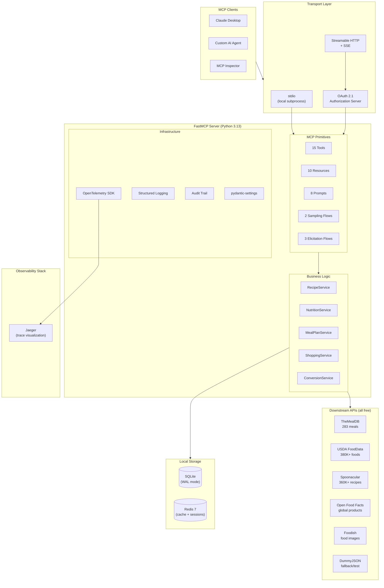
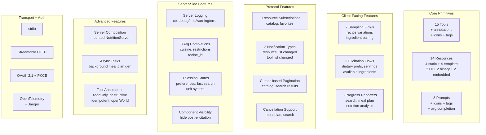
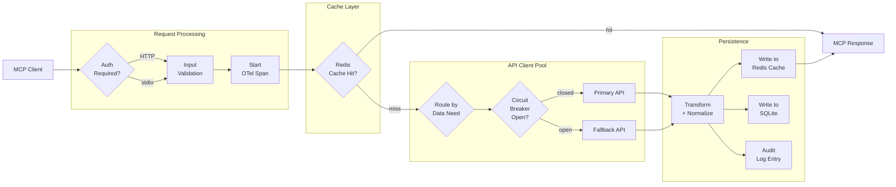
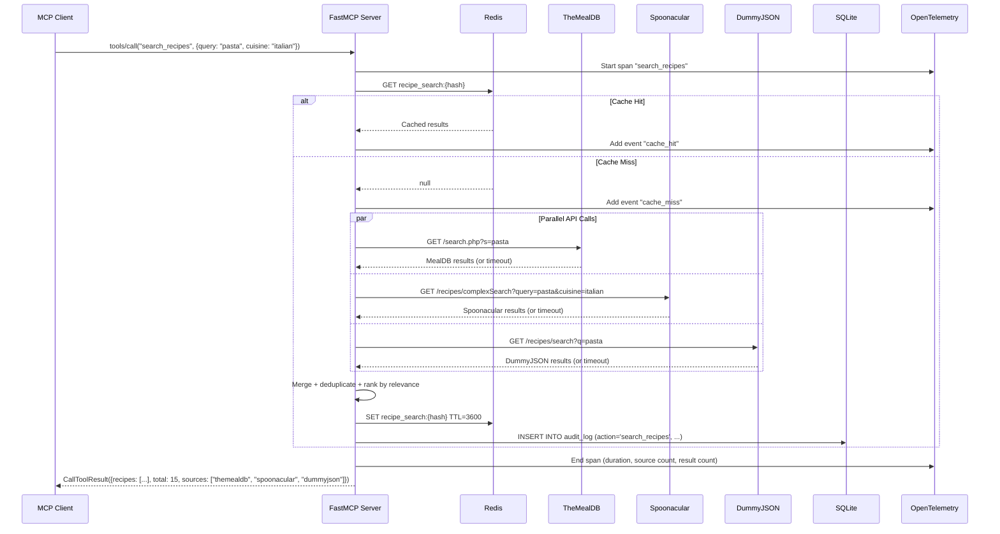
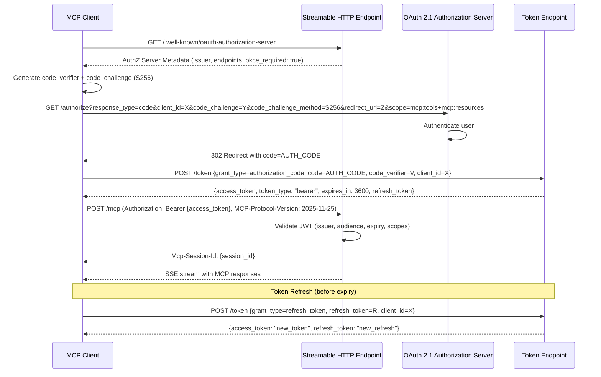
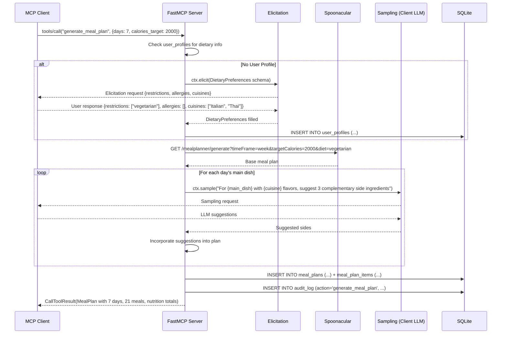
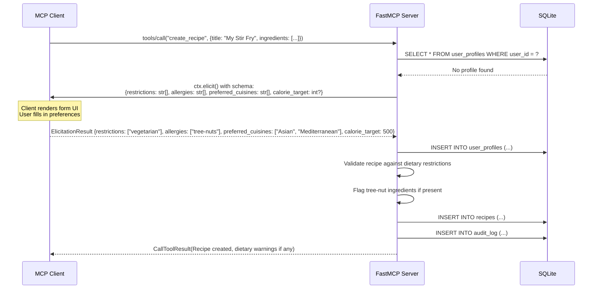
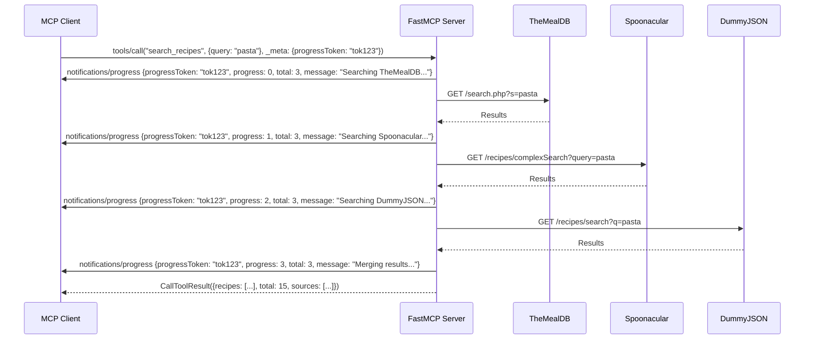
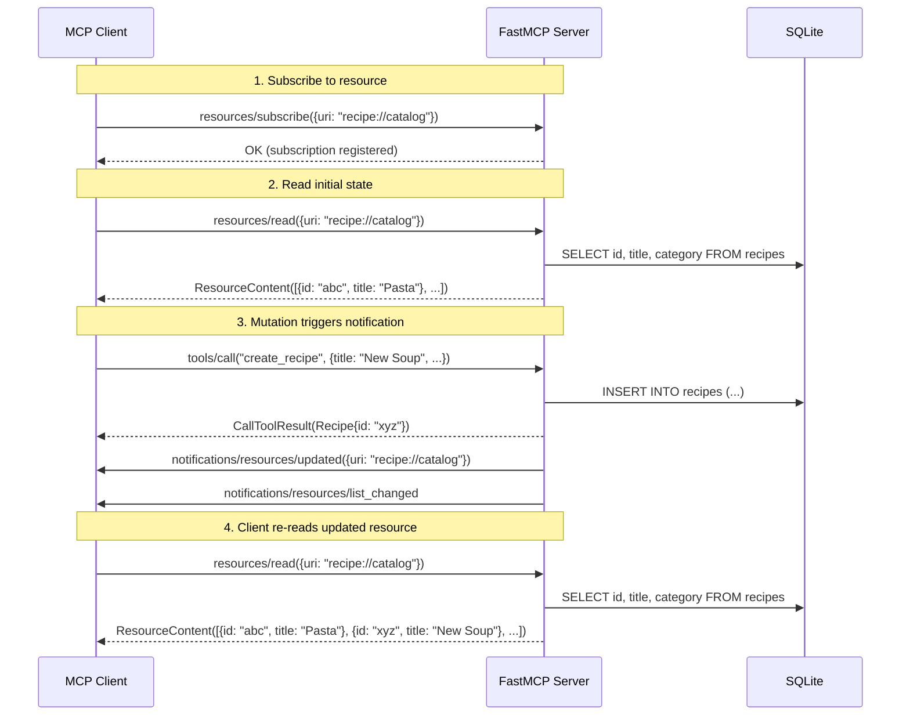

# Recipe MCP Server - Requirements Specification

> **Version:** 1.1.0
> **Status:** Draft
> **Last Updated:** 2026-03-19
> **MCP Protocol Version:** 2025-11-25

---

## Table of Contents

1. [Project Overview](#1-project-overview)
2. [System Architecture](#2-system-architecture)
3. [MCP Primitives Catalog](#3-mcp-primitives-catalog)
4. [Downstream API Contracts](#4-downstream-api-contracts)
5. [Data Models](#5-data-models)
6. [Sequence Diagrams](#6-sequence-diagrams)
7. [Non-Functional Requirements](#7-non-functional-requirements)
8. [Error Handling](#8-error-handling)
9. [Configuration](#9-configuration)
10. [Deployment](#10-deployment)
11. [Testing Strategy](#11-testing-strategy)
12. [Project Structure](#12-project-structure)
13. [Implementation Phases](#13-implementation-phases)

---

## 1. Project Overview

### 1.1 Purpose

The Recipe MCP Server is a **production-ready Model Context Protocol server** that provides LLM-powered clients with comprehensive recipe management capabilities. It serves a dual purpose:

1. **Learning showcase** -- demonstrates **every MCP capability** from the 2025-11-25 specification (23 distinct features) with real-world, non-trivial examples. This is designed to be the definitive reference for understanding what MCP can do.
2. **Production service** -- integrates into the `recipe-web-app` microservices ecosystem as a first-class backend, built to the same standards as sibling services (85%+ test coverage, Docker/K8s deployment, structured observability)

### 1.2 Target Clients

- **Claude Desktop** -- primary consumer via stdio transport
- **Custom AI agents** -- via Streamable HTTP transport with OAuth 2.1
- **MCP Inspector** -- for development and debugging
- **CI/CD test harness** -- automated protocol conformance testing

### 1.3 Technology Stack

| Component        | Technology              | Version       | Rationale                                                                                        |
| ---------------- | ----------------------- | ------------- | ------------------------------------------------------------------------------------------------ |
| Framework        | FastMCP                 | 3.1.1+        | Powers ~70% of MCP servers; native OTel; automatic schema generation                             |
| Language         | Python                  | 3.13+         | Latest stable; matches FastMCP requirements                                                      |
| Runtime Manager  | mise                    | Latest        | Manages Python version + task runner; replaces Makefile; single `.mise.toml` for tools and tasks |
| Package Manager  | uv                      | Latest        | Fast deterministic dependency resolution; lockfile (`uv.lock`); replaces pip/poetry              |
| Database         | SQLite (aiosqlite)      | 3.45+         | Zero-infrastructure; WAL mode for concurrency; async via aiosqlite                               |
| Cache            | Redis                   | 7+            | API response caching, session state, rate limiting                                               |
| ORM              | SQLAlchemy              | 2.0+          | Async support; repository pattern; Alembic migrations                                            |
| HTTP Client      | httpx                   | 0.28+         | Async, connection pooling, native timeout support                                                |
| Validation       | Pydantic                | 2.10+         | Automatic JSON Schema for MCP tool parameters                                                    |
| Configuration    | pydantic-settings       | 2.7+          | Typed config from env vars with .env support                                                     |
| Logging          | structlog               | 25.0+         | Structured JSON logging                                                                          |
| Tracing          | OpenTelemetry           | 1.30+         | Distributed tracing with Jaeger export                                                           |
| Retry            | tenacity                | 9.0+          | Exponential backoff with circuit breaker                                                         |
| Testing          | pytest + pytest-asyncio | 8.0+ / 0.25+  | Async test support with coverage                                                                 |
| Mocking          | respx + fakeredis       | 0.22+ / 2.26+ | httpx mocking + in-memory Redis                                                                  |
| Load Testing     | locust                  | 2.32+         | HTTP-based load testing                                                                          |
| Linting          | ruff                    | 0.9+          | Fast Python linter + formatter                                                                   |
| Image Generation | Pillow                  | 11.0+         | Generate nutrition pie charts for blob resources                                                 |
| Type Checking    | mypy                    | 1.14+         | Static type analysis                                                                             |

### 1.4 Toolchain: mise + uv

The project uses **mise** (formerly rtx) for runtime version management and task execution, paired with **uv** for Python package management. This replaces traditional Makefile + pip/poetry workflows.

**Division of responsibility:**

| Concern                              | Tool           | Config File                          |
| ------------------------------------ | -------------- | ------------------------------------ |
| Python version                       | mise           | `.mise.toml`                         |
| Tool versions (uv, ruff, etc.)       | mise           | `.mise.toml`                         |
| Task runner (test, lint, build, dev) | mise           | `.mise.toml`                         |
| Virtual environment activation       | mise           | `.mise.toml` (`python.uv_venv_auto`) |
| Package installation & resolution    | uv             | `pyproject.toml` + `uv.lock`         |
| Dependency locking                   | uv             | `uv.lock`                            |
| Project metadata & build             | uv (hatchling) | `pyproject.toml`                     |

**Developer onboarding:**

```bash
git clone <repo> && cd recipe-mcp-server
mise install        # Installs Python 3.13 + uv + all tools
uv sync             # Installs all dependencies into .venv
mise run dev        # Starts the server
```

### 1.5 Relationship to Monorepo

This server sits alongside 17+ services in `recipe-web-app/`:

```
recipe-web-app/
  auth-service/              # Go -- OAuth2 authentication
  recipe-management-service/ # Java/Spring Boot -- recipe CRUD
  recipe-scraper-service/    # Python -- recipe scraping
  recipe-mcp-server/         # Python FastMCP -- THIS PROJECT
  recipe-database/           # PostgreSQL
  redis-database/            # Redis (shared)
  ...
```

The MCP server can optionally integrate with the existing `auth-service` for OAuth token validation and `recipe-management-service` for recipe data, but operates independently with its own SQLite store and direct API integrations.

---

## 2. System Architecture

### 2.1 High-Level Architecture



### 2.2 Component Diagram -- All 23 MCP Capabilities



### 2.3 Data Flow -- Request Processing



---

## 3. MCP Primitives Catalog

### 3.1 Tools (15)

> **MCP Concept: Tools** are executable functions the server exposes to LLM clients. The client decides when to call them based on user intent. Tools are the primary way an MCP server _acts_ on the world.

Every tool in this project declares **annotations** (hints about behavior) and **tags** (for filtering). See [Section 3.6](#36-tool-annotations) for the annotation details.

#### Recipe CRUD

| Tool             | Description                                                                                                                                          | Annotations                               | Parameters                                                                                                                                                                           | Returns                                                              |
| ---------------- | ---------------------------------------------------------------------------------------------------------------------------------------------------- | ----------------------------------------- | ------------------------------------------------------------------------------------------------------------------------------------------------------------------------------------ | -------------------------------------------------------------------- |
| `search_recipes` | Search recipes across TheMealDB, Spoonacular, and DummyJSON with merged, deduplicated results. Supports **progress reporting** and **cancellation**. | `readOnlyHint=true`, `openWorldHint=true` | `query: str`, `cuisine?: str`, `diet?: str`, `max_results?: int (default 10)`, `cursor?: str`                                                                                        | `{recipes: Recipe[], total: int, sources: str[], next_cursor?: str}` |
| `get_recipe`     | Get full recipe details by ID. Returns **embedded resources** (HTML recipe card).                                                                    | `readOnlyHint=true`                       | `recipe_id: str`, `source?: str`, `include_variations?: bool`                                                                                                                        | `Recipe` + embedded `recipe://card/{id}` resource                    |
| `create_recipe`  | Create a new recipe in local SQLite. Emits **resource list changed** notification. May trigger **elicitation** for dietary preferences.              | _(default annotations)_                   | `title: str`, `ingredients: Ingredient[]`, `instructions: str[]`, `category?: str`, `area?: str`, `servings?: int`, `prep_time_min?: int`, `cook_time_min?: int`, `difficulty?: str` | `Recipe` with generated ID                                           |
| `update_recipe`  | Update an existing local recipe (partial updates). Emits **resource subscription** update for `recipe://catalog`.                                    | `idempotentHint=true`                     | `recipe_id: str`, `updates: Partial<Recipe>`                                                                                                                                         | Updated `Recipe`                                                     |
| `delete_recipe`  | Soft-delete a local recipe. Emits **resource list changed** notification.                                                                            | `destructiveHint=true`                    | `recipe_id: str`                                                                                                                                                                     | `{success: bool, message: str}`                                      |

#### Nutrition

| Tool                       | Description                                                                                                                                                         | Annotations         | Parameters                                | Returns                                                                                                                      |
| -------------------------- | ------------------------------------------------------------------------------------------------------------------------------------------------------------------- | ------------------- | ----------------------------------------- | ---------------------------------------------------------------------------------------------------------------------------- |
| `lookup_nutrition`         | Get nutrition data for a food item from USDA FoodData Central                                                                                                       | `readOnlyHint=true` | `food_name: str`, `portion_grams?: float` | `NutrientInfo` with calories, macros, micros                                                                                 |
| `analyze_recipe_nutrition` | Calculate full nutritional breakdown for an entire recipe. Supports **progress reporting** (per-ingredient). Returns **embedded resources** (HTML nutrition label). | `readOnlyHint=true` | `recipe_id: str`, `servings?: int`        | `{per_serving: NutrientInfo, total: NutrientInfo, ingredients: IngredientNutrition[]}` + embedded `nutrition://label/{food}` |

#### Meal Planning

| Tool                     | Description                                                                                                                                                | Annotations              | Parameters                                                                                                                  | Returns                                                |
| ------------------------ | ---------------------------------------------------------------------------------------------------------------------------------------------------------- | ------------------------ | --------------------------------------------------------------------------------------------------------------------------- | ------------------------------------------------------ |
| `generate_meal_plan`     | Generate a meal plan using Spoonacular + local recipes. Uses **sampling**, **elicitation**, **progress reporting**, **cancellation**, and **async tasks**. | _(default)_, `task=True` | `days: int (1-14)`, `diet?: str`, `calories_target?: int`, `meals_per_day?: int (default 3)`, `exclude_ingredients?: str[]` | `MealPlan` with daily meals (or `TaskHandle` if async) |
| `generate_shopping_list` | Aggregate and deduplicate ingredients from recipes or a meal plan                                                                                          | _(default annotations)_  | `recipe_ids?: str[]`, `meal_plan_id?: str`, `servings?: int`                                                                | `{items: ShoppingItem[], estimated_cost?: str}`        |

#### Utility

| Tool                | Description                                                                                                 | Annotations                                | Parameters                                                           | Returns                                                                           |
| ------------------- | ----------------------------------------------------------------------------------------------------------- | ------------------------------------------ | -------------------------------------------------------------------- | --------------------------------------------------------------------------------- |
| `scale_recipe`      | Scale recipe ingredients to target servings. Uses **elicitation** to confirm unusual sizes (>20).           | _(default annotations)_                    | `recipe_id: str`, `target_servings: int`                             | `{original_servings: int, target_servings: int, ingredients: ScaledIngredient[]}` |
| `convert_units`     | Convert between cooking measurement units (volume, weight, temperature)                                     | `readOnlyHint=true`, `idempotentHint=true` | `value: float`, `from_unit: str`, `to_unit: str`, `ingredient?: str` | `{result: float, from: str, to: str, note?: str}`                                 |
| `get_substitutes`   | Find ingredient substitutions from Spoonacular + built-in rules                                             | `readOnlyHint=true`                        | `ingredient: str`                                                    | `{substitutes: Substitute[], source: str}`                                        |
| `get_wine_pairing`  | Suggest wine pairings for a dish or ingredient via Spoonacular                                              | `readOnlyHint=true`                        | `food: str`                                                          | `{paired_wines: str[], description: str, product_suggestions?: WineProduct[]}`    |
| `save_favorite`     | Save a recipe to user favorites. Emits **resource subscription** update for `recipe://favorites/{user_id}`. | `idempotentHint=true`                      | `recipe_id: str`, `rating?: int (1-5)`, `notes?: str`                | `{success: bool, favorite: Favorite}`                                             |
| `get_random_recipe` | Get a random recipe with a random food image from Foodish                                                   | `readOnlyHint=true`                        | `category?: str`, `area?: str`                                       | `Recipe` with Foodish image                                                       |

### 3.2 Resources (14)

#### Static Resources (4)

| URI                    | Description                                                                  | Content Type       | Refresh     |
| ---------------------- | ---------------------------------------------------------------------------- | ------------------ | ----------- |
| `recipe://catalog`     | Complete list of locally-stored recipe summaries (id, title, category, area) | `application/json` | On mutation |
| `recipe://categories`  | All available recipe categories aggregated from TheMealDB + local            | `application/json` | Daily       |
| `recipe://cuisines`    | All available cuisine areas/regions from TheMealDB + local                   | `application/json` | Daily       |
| `recipe://ingredients` | Master ingredient list from TheMealDB + USDA                                 | `application/json` | Weekly      |

#### Templated Resources (4)

| URI Pattern                    | Description                                                              | Content Type       |
| ------------------------------ | ------------------------------------------------------------------------ | ------------------ |
| `recipe://recipe/{recipe_id}`  | Full recipe details including ingredients, instructions, and source info | `application/json` |
| `nutrition://{food_name}`      | USDA nutrition facts for a specific food (cached 7 days)                 | `application/json` |
| `mealplan://{plan_id}`         | Complete meal plan with all days, meals, and linked recipes              | `application/json` |
| `recipe://favorites/{user_id}` | User's saved favorite recipes with ratings and notes                     | `application/json` |

#### UI Resources (2)

> **MCP Concept: UI Resources** return renderable content (HTML, Markdown) that MCP clients can display directly to users, not just pass to the LLM.

| URI Pattern                     | Description                                                                                                         | Content Type |
| ------------------------------- | ------------------------------------------------------------------------------------------------------------------- | ------------ |
| `recipe://card/{recipe_id}`     | HTML-rendered recipe card with image, ingredients, and instructions -- styled for display in supporting MCP clients | `text/html`  |
| `nutrition://label/{food_name}` | HTML-rendered FDA-style nutrition facts label                                                                       | `text/html`  |

#### Binary/Blob Resources (2)

> **MCP Concept: Blob Resources** return base64-encoded binary content. This demonstrates that MCP resources aren't limited to text -- they can serve images, PDFs, audio, or any binary format.

| URI Pattern                     | Description                                                                                                                  | Content Type | Source                   |
| ------------------------------- | ---------------------------------------------------------------------------------------------------------------------------- | ------------ | ------------------------ |
| `recipe://photo/{recipe_id}`    | Recipe photo as base64-encoded PNG. Fetched from TheMealDB `strMealThumb` URL or Foodish, then served as a blob resource.    | `image/png`  | TheMealDB / Foodish      |
| `nutrition://chart/{food_name}` | Dynamically generated macronutrient pie chart (protein/fat/carbs) as base64-encoded PNG. Generated server-side using Pillow. | `image/png`  | Generated from USDA data |

**Why this matters:** Many MCP use cases involve non-text data (charts, diagrams, photos). Blob resources let the server deliver binary content through the same resource URI system, with the client deciding how to render it.

### 3.3 Prompts (8)

| Prompt Name            | Description                                                                 | Parameters                                                                                                             | Returns                                          |
| ---------------------- | --------------------------------------------------------------------------- | ---------------------------------------------------------------------------------------------------------------------- | ------------------------------------------------ |
| `generate_recipe`      | System + user prompt for creating a new recipe from constraints             | `cuisine: str`, `main_ingredient?: str`, `difficulty?: str ("easy"\|"medium"\|"hard")`, `dietary_restrictions?: str[]` | Multi-message prompt sequence                    |
| `weekly_meal_plan`     | Structured prompt for generating a complete weekly meal plan                | `people_count: int`, `diet?: str`, `budget?: str ("low"\|"medium"\|"high")`, `cooking_skill?: str`                     | Planning prompt with nutritional guidelines      |
| `adapt_for_diet`       | Prompt to modify an existing recipe for specific dietary needs              | `recipe_id: str`, `restrictions: str[]`                                                                                | Adaptation prompt with ingredient context        |
| `cooking_instructions` | Detailed step-by-step cooking guidance for a recipe                         | `recipe_id: str`, `skill_level?: str ("beginner"\|"intermediate"\|"advanced")`                                         | Instructional prompt with technique explanations |
| `ingredient_spotlight` | Deep dive prompt into an ingredient's history, uses, nutrition, and storage | `ingredient: str`                                                                                                      | Educational prompt with facts and tips           |
| `leftover_recipe`      | Creative recipe generation from available leftover ingredients              | `ingredients: str[]`                                                                                                   | Constrained recipe prompt                        |
| `holiday_menu`         | Plan a complete multi-course holiday/occasion menu                          | `occasion: str`, `guest_count: int`, `restrictions?: str[]`                                                            | Menu planning prompt with courses                |
| `quick_meal`           | Suggest a quick meal achievable under a time limit                          | `max_minutes: int`, `available_ingredients?: str[]`                                                                    | Time-constrained recipe prompt                   |

### 3.4 Sampling (2)

Sampling allows the server to request LLM completions from the client during tool execution.

| Use Case                    | Triggered By                                    | Sampling Prompt                                                                                                                       | Purpose                                                        |
| --------------------------- | ----------------------------------------------- | ------------------------------------------------------------------------------------------------------------------------------------- | -------------------------------------------------------------- |
| `suggest_recipe_variations` | `get_recipe` when `include_variations=true`     | "Given this recipe for {title}, suggest 3 creative variations: one fusion twist, one seasonal adaptation, and one simplified version" | Enhance recipe results with AI-generated creative alternatives |
| `pair_ingredients`          | `generate_meal_plan` during side dish selection | "For a main dish featuring {main_ingredient} with {cuisine} flavors, suggest 3 complementary side ingredients with brief reasoning"   | AI-assisted complementary ingredient selection for meal plans  |

**Implementation:** Invoked via `ctx.sample()` within tool handlers. The client LLM processes the request and returns suggestions that are incorporated into the tool response.

### 3.5 Elicitation (3)

Elicitation allows the server to request structured information from the user during tool execution.

| Use Case                        | Triggered By                                                        | Schema                                                                                     | Purpose                                                     |
| ------------------------------- | ------------------------------------------------------------------- | ------------------------------------------------------------------------------------------ | ----------------------------------------------------------- |
| `gather_dietary_preferences`    | `generate_meal_plan` or `create_recipe` when no user profile exists | `{restrictions: str[], allergies: str[], preferred_cuisines: str[], calorie_target?: int}` | Collect dietary info before generating personalized results |
| `confirm_serving_size`          | `scale_recipe` when `target_servings > 20`                          | `{confirmed_servings: int, reason: str ("party"\|"meal_prep"\|"restaurant"\|"other")}`     | Verify unusual serving counts aren't typos                  |
| `clarify_available_ingredients` | `leftover_recipe` prompt when ingredients are vague                 | `{ingredients: str[], pantry_staples_available: bool, cooking_equipment: str[]}`           | Get precise ingredient list and kitchen context             |

**Implementation:** Invoked via `ctx.elicit()` with a Pydantic model defining the form schema. Tool execution pauses until the user responds.

### 3.6 Tool Annotations

> **MCP Concept: Tool Annotations** are hints that describe a tool's behavior to the client. They don't enforce anything -- they help clients make smarter decisions about when/how to call tools (e.g., skipping confirmation for read-only tools, warning before destructive ones).

| Annotation             | Meaning                                                                                         | Tools Using It                                                                                                                                              |
| ---------------------- | ----------------------------------------------------------------------------------------------- | ----------------------------------------------------------------------------------------------------------------------------------------------------------- |
| `readOnlyHint=true`    | Tool does not modify any server state                                                           | `search_recipes`, `get_recipe`, `lookup_nutrition`, `analyze_recipe_nutrition`, `convert_units`, `get_wine_pairing`, `get_random_recipe`, `get_substitutes` |
| `destructiveHint=true` | Tool may permanently modify or delete data                                                      | `delete_recipe`                                                                                                                                             |
| `idempotentHint=true`  | Calling the tool multiple times with the same input has the same effect as calling it once      | `save_favorite`, `update_recipe`, `convert_units`                                                                                                           |
| `openWorldHint=true`   | Tool can handle a wide variety of input formats and does not require strict parameter adherence | `search_recipes` (accepts natural language queries, partial matches, fuzzy cuisine names)                                                                   |

**Default behavior:** Tools without explicit annotations use MCP defaults (`readOnlyHint=false`, `destructiveHint=false`, `idempotentHint=false`, `openWorldHint=false`). This applies to: `create_recipe`, `generate_meal_plan`, `generate_shopping_list`, `scale_recipe`.

### 3.7 Embedded Resources in Tool Results

> **MCP Concept: Embedded Resources** allow tool results to include full resource objects alongside their text/JSON output. This lets a single tool call deliver both structured data (for the LLM) and rendered content (for the user) without requiring a separate `resources/read` call.

| Tool                       | Embedded Resource                      | Why                                                                                                                                |
| -------------------------- | -------------------------------------- | ---------------------------------------------------------------------------------------------------------------------------------- |
| `get_recipe`               | `recipe://card/{recipe_id}` (HTML)     | The tool returns recipe JSON for the LLM to reason about, plus an HTML recipe card that supporting clients can render for the user |
| `analyze_recipe_nutrition` | `nutrition://label/{food_name}` (HTML) | The tool returns structured nutrition data for the LLM, plus an FDA-style nutrition label for visual display                       |

**Implementation pattern (FastMCP):**

```python
@mcp.tool()
async def get_recipe(recipe_id: str, ctx: Context) -> list[Content]:
    recipe = await recipe_service.get(recipe_id)
    card_html = await render_recipe_card(recipe)
    return [
        TextContent(text=recipe.model_dump_json()),
        EmbeddedResource(resource=TextResourceContents(
            uri=f"recipe://card/{recipe_id}",
            text=card_html,
            mimeType="text/html"
        ))
    ]
```

### 3.8 Resource Subscriptions & Notifications

> **MCP Concept: Resource Subscriptions** let clients subscribe to specific resources and receive notifications when those resources change. **Notifications** are one-way messages from server to client about state changes.

#### Resource Subscriptions (2)

| Resource URI                   | Trigger                                              | Notification Content                              |
| ------------------------------ | ---------------------------------------------------- | ------------------------------------------------- |
| `recipe://catalog`             | Recipe created, updated, or deleted via any tool     | Updated catalog JSON (or notification to re-read) |
| `recipe://favorites/{user_id}` | User saves or removes a favorite via `save_favorite` | Updated favorites list for that user              |

**Client interaction flow:**

1. Client calls `resources/subscribe` with URI `recipe://catalog`
2. Server tracks the subscription
3. When `create_recipe` or `delete_recipe` is called, server emits `notifications/resources/updated` for `recipe://catalog`
4. Client receives notification and re-reads the resource

#### Resource List Changed Notifications

| Notification                           | Trigger                                                                                  | Why                                                                                     |
| -------------------------------------- | ---------------------------------------------------------------------------------------- | --------------------------------------------------------------------------------------- |
| `notifications/resources/list_changed` | New recipe created (adds `recipe://recipe/{new_id}` URI) or recipe deleted (removes URI) | The set of available resource URIs has changed -- clients should re-enumerate resources |

#### Tool List Changed Notifications

| Notification                       | Trigger                                                                                        | Why                                                                                       |
| ---------------------------------- | ---------------------------------------------------------------------------------------------- | ----------------------------------------------------------------------------------------- |
| `notifications/tools/list_changed` | Seasonal tool `get_holiday_recipes` dynamically registered (Nov-Dec) or unregistered (Jan-Oct) | Demonstrates that the tool set can change at runtime -- clients should re-enumerate tools |

**Why this matters:** Subscriptions + notifications enable reactive UIs. Without them, clients must poll for changes. This is the MCP equivalent of WebSocket subscriptions or GraphQL subscriptions.

### 3.9 Progress Reporting

> **MCP Concept: Progress Reporting** lets long-running tools send incremental status updates to the client during execution. The client can display these to the user (e.g., a progress bar or status messages). Uses `progressToken` from the request metadata.

| Tool                       | Progress Steps               | Example Messages                                                                                          |
| -------------------------- | ---------------------------- | --------------------------------------------------------------------------------------------------------- |
| `search_recipes`           | 3 steps (one per API)        | "Searching TheMealDB... (1/3)", "Searching Spoonacular... (2/3)", "Searching DummyJSON... (3/3)"          |
| `generate_meal_plan`       | N steps (one per day)        | "Planning Monday... (1/7)", "Planning Tuesday... (2/7)", ..., "Finalizing meal plan... (7/7)"             |
| `analyze_recipe_nutrition` | N steps (one per ingredient) | "Looking up chicken breast... (1/8)", "Looking up olive oil... (2/8)", ..., "Calculating totals... (8/8)" |

**Implementation pattern (FastMCP):**

```python
@mcp.tool()
async def search_recipes(query: str, ctx: Context) -> dict:
    apis = [("TheMealDB", mealdb), ("Spoonacular", spoonacular), ("DummyJSON", dummyjson)]
    results = []
    for i, (name, client) in enumerate(apis):
        await ctx.report_progress(i, len(apis), f"Searching {name}...")
        results.extend(await client.search(query))
    await ctx.report_progress(len(apis), len(apis), "Merging results...")
    return merge_and_deduplicate(results)
```

### 3.10 Server Logging

> **MCP Concept: Server Logging** sends structured log messages from the server to the MCP client (not to files -- that's structlog's job). This gives clients visibility into what the server is doing, useful for debugging and transparency.

| Level           | When Used                               | Example                                                                      |
| --------------- | --------------------------------------- | ---------------------------------------------------------------------------- |
| `ctx.debug()`   | Detailed internal operations            | `"Cache key: recipe_search:a1b2c3, TTL remaining: 2847s"`                    |
| `ctx.info()`    | Normal operational events               | `"Searching 3 APIs for query='pasta', cuisine='italian'"`                    |
| `ctx.warning()` | Degraded operation (fallbacks, retries) | `"Spoonacular returned 429, falling back to DummyJSON"`                      |
| `ctx.error()`   | Operation failures                      | `"All recipe APIs failed for query='pasta'. Returning cached results only."` |

**Dual logging architecture:**

- **Server logging** (`ctx.info()` etc.) → sent to MCP client → visible in Claude Desktop / MCP Inspector
- **structlog** → written to stdout/files → visible in Docker logs / Jaeger

Both systems log every tool call, but to different audiences. This is deliberate -- the client sees high-level events while operators see detailed traces.

### 3.11 Argument Completion

> **MCP Concept: Completion** provides auto-complete suggestions for prompt arguments and resource template parameters. When a client starts typing a value, the server can suggest valid completions.

| Component                              | Parameter      | Completions Source                                                                                     |
| -------------------------------------- | -------------- | ------------------------------------------------------------------------------------------------------ |
| Prompt `generate_recipe`               | `cuisine`      | Known cuisine list from `recipe://cuisines` resource (e.g., "Italian", "Japanese", "Mexican", "Thai")  |
| Prompt `adapt_for_diet`                | `restrictions` | Known dietary restrictions (e.g., "vegetarian", "vegan", "gluten-free", "dairy-free", "keto", "paleo") |
| Resource `recipe://recipe/{recipe_id}` | `recipe_id`    | IDs of locally-stored recipes from SQLite                                                              |

**Implementation pattern (FastMCP):**

```python
@mcp.prompt()
async def generate_recipe(cuisine: Annotated[str, Completion(provider=cuisine_completer)]) -> list[Message]:
    ...

async def cuisine_completer(prefix: str) -> list[str]:
    cuisines = await recipe_service.list_cuisines()
    return [c for c in cuisines if c.lower().startswith(prefix.lower())]
```

### 3.12 Pagination

> **MCP Concept: Pagination** uses opaque cursor tokens (not page numbers) to paginate through large result sets. This works for both resource reads and tool results.

| Component                   | Pagination Support                                                 | Page Size                     |
| --------------------------- | ------------------------------------------------------------------ | ----------------------------- |
| Resource `recipe://catalog` | Cursor-based; returns `next_cursor` in response metadata           | 50 recipes per page           |
| Tool `search_recipes`       | Accepts `cursor?: str` parameter; returns `next_cursor` in results | 10 results per page (default) |
| `resources/list`            | Cursor-based pagination of the resource list itself                | 100 URIs per page             |
| `tools/list`                | Cursor-based pagination of the tool list                           | 50 tools per page             |
| `prompts/list`              | Cursor-based pagination of the prompt list                         | 50 prompts per page           |

**Why cursors, not page numbers?** Cursor tokens are opaque strings that encode position in the result set. This avoids issues with items being added/removed between page fetches (which breaks offset-based pagination).

### 3.13 Cancellation

> **MCP Concept: Cancellation** lets clients abort in-progress tool calls by sending a `notifications/cancelled` message with the original request ID and an optional reason.

| Tool                 | Cancellation Behavior                                                                                                |
| -------------------- | -------------------------------------------------------------------------------------------------------------------- |
| `generate_meal_plan` | Aborts after completing the current day; returns partial meal plan for days completed so far                         |
| `search_recipes`     | Cancels any in-flight API requests (via `httpx` task cancellation); returns results from APIs that already responded |

**Implementation pattern:**

```python
@mcp.tool()
async def search_recipes(query: str, ctx: Context) -> dict:
    tasks = [search_mealdb(query), search_spoonacular(query), search_dummyjson(query)]
    # asyncio.gather with return_exceptions=True allows partial results
    # FastMCP automatically handles cancellation by cancelling the tool's asyncio task
    results = await asyncio.gather(*tasks, return_exceptions=True)
    return merge_successful_results(results)
```

### 3.14 Session State

> **MCP Concept: Session State** lets tools persist data across multiple calls within the same MCP session (connection). State is lost when the session ends. This is different from database persistence -- it's for ephemeral, session-scoped context.

| State Key          | Set By                                           | Used By                                                 | Purpose                                                                                    |
| ------------------ | ------------------------------------------------ | ------------------------------------------------------- | ------------------------------------------------------------------------------------------ |
| `user_preferences` | `gather_dietary_preferences` elicitation         | `generate_meal_plan`, `create_recipe`, `search_recipes` | Avoid re-eliciting dietary preferences within the same session                             |
| `last_search`      | `search_recipes`                                 | `generate_meal_plan`, `get_recipe`                      | Remember last search for contextual follow-up ("use the pasta recipe from my last search") |
| `unit_system`      | `convert_units` (inferred from first conversion) | `scale_recipe`, `generate_shopping_list`                | Remember metric vs imperial preference                                                     |

**Implementation pattern (FastMCP):**

```python
@mcp.tool()
async def search_recipes(query: str, ctx: Context) -> dict:
    results = await recipe_service.search(query)
    ctx.set_state("last_search", {"query": query, "results": [r.id for r in results]})
    return results

@mcp.tool()
async def generate_meal_plan(days: int, ctx: Context) -> MealPlan:
    prefs = ctx.get_state("user_preferences")
    if not prefs:
        prefs = await ctx.elicit(DietaryPreferences)
        ctx.set_state("user_preferences", prefs)
    ...
```

### 3.15 Component Visibility

> **MCP Concept: Component Visibility** lets the server dynamically show/hide tools, resources, or prompts for a specific session. This is useful for progressive disclosure -- showing more features as the user needs them, or hiding features that are no longer relevant.

| Action                                                   | Trigger                                                 | Effect                                                                                                                        |
| -------------------------------------------------------- | ------------------------------------------------------- | ----------------------------------------------------------------------------------------------------------------------------- |
| `ctx.disable_components(["gather_dietary_preferences"])` | After dietary preferences are collected via elicitation | The `gather_dietary_preferences` elicitation flow is hidden from the tool list for this session (it's already been collected) |

**Why this matters:** Without visibility control, clients see all tools/resources/prompts at all times. This can be overwhelming. Visibility control lets the server curate what's available based on session context.

### 3.16 Tags & Icons

> **MCP Concept: Tags** categorize components for filtering/grouping. **Icons** provide visual representations in supporting clients. Both are optional metadata.

#### Tags

| Tag           | Applied To                                                                                                                                                                                               |
| ------------- | -------------------------------------------------------------------------------------------------------------------------------------------------------------------------------------------------------- |
| `recipe`      | `search_recipes`, `get_recipe`, `create_recipe`, `update_recipe`, `delete_recipe`, `scale_recipe`, `get_random_recipe`, `recipe://catalog`, `recipe://recipe/{id}`, `generate_recipe`, `leftover_recipe` |
| `nutrition`   | `lookup_nutrition`, `analyze_recipe_nutrition`, `nutrition://{food}`, `nutrition://label/{food}`, `nutrition://chart/{food}`, `ingredient_spotlight`                                                     |
| `planning`    | `generate_meal_plan`, `generate_shopping_list`, `mealplan://{id}`, `weekly_meal_plan`, `holiday_menu`                                                                                                    |
| `utility`     | `convert_units`, `get_substitutes`, `get_wine_pairing`, `save_favorite`                                                                                                                                  |
| `creative`    | `generate_recipe`, `leftover_recipe`, `quick_meal`, `suggest_recipe_variations`                                                                                                                          |
| `educational` | `cooking_instructions`, `ingredient_spotlight`, `adapt_for_diet`                                                                                                                                         |

#### Icons (Key Components)

| Component            | Icon             | Purpose                               |
| -------------------- | ---------------- | ------------------------------------- |
| `search_recipes`     | magnifying glass | Visual cue for search                 |
| `create_recipe`      | plus circle      | Visual cue for creation               |
| `delete_recipe`      | trash            | Visual warning for destructive action |
| `lookup_nutrition`   | apple            | Food/nutrition association            |
| `generate_meal_plan` | calendar         | Planning association                  |
| `recipe://catalog`   | book             | Collection/catalog association        |
| `generate_recipe`    | sparkles         | Creative/AI generation                |

### 3.17 Server Composition

> **MCP Concept: Server Composition** lets you build an MCP server by combining multiple smaller servers. Each sub-server is "mounted" at a namespace prefix, keeping its tools/resources/prompts isolated but accessible through the parent server.

**Architecture:**

```
Main Server (recipe-mcp-server)
├── All recipe tools, resources, prompts (no prefix)
└── Mounted: NutritionMCPServer (prefix: "nutrition")
    ├── Tool: nutrition_lookup_nutrition → exposed as "nutrition_lookup_nutrition"
    ├── Tool: nutrition_analyze_recipe_nutrition
    ├── Resource: nutrition://... → exposed as nutrition://...
    └── Prompt: nutrition_ingredient_spotlight
```

**Implementation:**

```python
# nutrition_server.py -- standalone mini MCP server
nutrition_mcp = FastMCP("nutrition-server")

@nutrition_mcp.tool()
async def lookup_nutrition(food_name: str) -> NutrientInfo: ...

@nutrition_mcp.resource("nutrition://{food_name}")
async def nutrition_resource(food_name: str) -> str: ...

# server.py -- main server
mcp = FastMCP("recipe-mcp-server")
mcp.mount(nutrition_mcp, prefix="nutrition")
```

**Why this matters:** Composition enables:

- Building MCP servers from reusable pieces
- Teams owning separate sub-servers that compose into one
- Testing sub-servers in isolation
- Proxying remote MCP servers into a local aggregator

### 3.18 Async Tasks (Experimental)

> **MCP Concept: Tasks** (experimental in 2025-11-25 spec) enable fire-and-forget tool execution. The client calls a tool, receives a task handle immediately, and polls for completion. This is essential for long-running operations that shouldn't block the conversation.

| Tool                 | Task Support                | Poll Interval       | Cancellation                      |
| -------------------- | --------------------------- | ------------------- | --------------------------------- |
| `generate_meal_plan` | `task=True` (optional mode) | 5 seconds (default) | Supported -- returns partial plan |

**Task lifecycle:**

```
Client                          Server
  │                               │
  ├─ tools/call(generate_meal_plan, _meta.progressToken=T)
  │                               ├─ Returns TaskHandle {task_id: "abc123", status: "working"}
  │                               │
  ├─ tasks/get({task_id: "abc123"})
  │                               ├─ {status: "working", progress: 3, total: 7, message: "Planning Wednesday..."}
  │                               │
  ├─ tasks/get({task_id: "abc123"})
  │                               ├─ {status: "completed", result: MealPlan{...}}
  │                               │
```

**Task states:** `working` → `completed` | `failed` | `cancelled` | `input_required`

The `input_required` state is used when the task needs elicitation mid-execution (e.g., dietary preferences needed during meal plan generation).

### 3.19 Capability Summary

This project demonstrates **23 distinct MCP capabilities**:

| #   | Capability             | Section | Example in This Project                      |
| --- | ---------------------- | ------- | -------------------------------------------- |
| 1   | Tools                  | 3.1     | 15 recipe/nutrition/planning tools           |
| 2   | Tool Annotations       | 3.6     | readOnly, destructive, idempotent, openWorld |
| 3   | Static Resources       | 3.2     | catalog, categories, cuisines, ingredients   |
| 4   | Resource Templates     | 3.2     | recipe://{id}, nutrition://{food}            |
| 5   | UI Resources (HTML)    | 3.2     | Recipe cards, nutrition labels               |
| 6   | Binary/Blob Resources  | 3.2     | Recipe photos, macro charts                  |
| 7   | Embedded Resources     | 3.7     | get_recipe returns HTML card in result       |
| 8   | Resource Subscriptions | 3.8     | catalog and favorites subscriptions          |
| 9   | Resource List Changed  | 3.8     | Notification on recipe create/delete         |
| 10  | Tool List Changed      | 3.8     | Seasonal tool registration                   |
| 11  | Prompts                | 3.3     | 8 recipe/planning/educational prompts        |
| 12  | Sampling               | 3.4     | Recipe variations, ingredient pairing        |
| 13  | Elicitation            | 3.5     | Dietary prefs, serving confirm, ingredients  |
| 14  | Progress Reporting     | 3.9     | Per-API search, per-day meal plan            |
| 15  | Server Logging         | 3.10    | debug/info/warning/error to client           |
| 16  | Argument Completion    | 3.11    | Cuisine, restriction, recipe_id completions  |
| 17  | Pagination             | 3.12    | Cursor-based on catalog and search           |
| 18  | Cancellation           | 3.13    | Abort meal plan gen, abort search            |
| 19  | Session State          | 3.14    | Preferences, last search, unit system        |
| 20  | Component Visibility   | 3.15    | Hide elicitation after collection            |
| 21  | Tags & Icons           | 3.16    | Categorization and visual cues               |
| 22  | Server Composition     | 3.17    | Mounted NutritionMCPServer                   |
| 23  | Async Tasks            | 3.18    | Background meal plan generation              |

**Additionally demonstrated (infrastructure-level):**

- stdio transport (Claude Desktop)
- Streamable HTTP transport (remote clients)
- OAuth 2.1 with PKCE (HTTP authentication)
- OpenTelemetry tracing (Jaeger visualization)
- Capability negotiation (server initialization)

---

## 4. Downstream API Contracts

### 4.1 TheMealDB

| Property           | Value                                       |
| ------------------ | ------------------------------------------- |
| **Base URL**       | `https://www.themealdb.com/api/json/v1/1`   |
| **Authentication** | Test API key `1` (embedded in URL path)     |
| **Rate Limit**     | Undocumented (free tier)                    |
| **Data**           | 283 meals, 574 ingredients, images included |

**Endpoints Used:**

| Endpoint                     | Method | Purpose                | Cache TTL |
| ---------------------------- | ------ | ---------------------- | --------- |
| `/search.php?s={name}`       | GET    | Search meals by name   | 1 hour    |
| `/lookup.php?i={id}`         | GET    | Get meal by ID         | 24 hours  |
| `/random.php`                | GET    | Random meal            | No cache  |
| `/filter.php?c={category}`   | GET    | Filter by category     | 6 hours   |
| `/filter.php?a={area}`       | GET    | Filter by area/cuisine | 6 hours   |
| `/filter.php?i={ingredient}` | GET    | Filter by ingredient   | 1 hour    |
| `/categories.php`            | GET    | List all categories    | 24 hours  |
| `/list.php?c=list`           | GET    | List category names    | 24 hours  |
| `/list.php?a=list`           | GET    | List area names        | 24 hours  |
| `/list.php?i=list`           | GET    | List ingredient names  | 24 hours  |

**Response Shape (search):**

```json
{
  "meals": [
    {
      "idMeal": "52771",
      "strMeal": "Spicy Arrabiata Penne",
      "strCategory": "Vegetarian",
      "strArea": "Italian",
      "strInstructions": "...",
      "strMealThumb": "https://...",
      "strIngredient1": "penne rigate",
      "strMeasure1": "1 pound",
      "strIngredient2": "olive oil",
      "strMeasure2": "1/4 cup"
    }
  ]
}
```

### 4.2 USDA FoodData Central

| Property           | Value                                                       |
| ------------------ | ----------------------------------------------------------- |
| **Base URL**       | `https://api.nal.usda.gov/fdc/v1`                           |
| **Authentication** | API key via query param `api_key` (free signup at data.gov) |
| **Rate Limit**     | 1,000 requests/hour per IP                                  |
| **Data**           | 380,000+ foods with full nutrient profiles                  |
| **License**        | Public domain (CC0 1.0)                                     |

**Endpoints Used:**

| Endpoint                                | Method | Purpose                   | Cache TTL |
| --------------------------------------- | ------ | ------------------------- | --------- |
| `/foods/search?query={q}&api_key={key}` | GET    | Search foods by name      | 7 days    |
| `/food/{fdcId}?api_key={key}`           | GET    | Get food by FDC ID        | 7 days    |
| `/foods?api_key={key}`                  | POST   | Get multiple foods by IDs | 7 days    |

**Response Shape (search):**

```json
{
  "totalHits": 1234,
  "foods": [
    {
      "fdcId": 534358,
      "description": "Chicken breast, raw",
      "dataType": "SR Legacy",
      "foodNutrients": [
        {
          "nutrientId": 1008,
          "nutrientName": "Energy",
          "value": 120,
          "unitName": "kcal"
        },
        {
          "nutrientId": 1003,
          "nutrientName": "Protein",
          "value": 22.5,
          "unitName": "g"
        },
        {
          "nutrientId": 1004,
          "nutrientName": "Total lipid (fat)",
          "value": 2.62,
          "unitName": "g"
        },
        {
          "nutrientId": 1005,
          "nutrientName": "Carbohydrate",
          "value": 0,
          "unitName": "g"
        }
      ]
    }
  ]
}
```

### 4.3 Spoonacular

| Property           | Value                                                                 |
| ------------------ | --------------------------------------------------------------------- |
| **Base URL**       | `https://api.spoonacular.com`                                         |
| **Authentication** | API key via query param `apiKey`                                      |
| **Rate Limit**     | Free tier: 150 requests/day, 1 request/second                         |
| **Data**           | 360,000+ recipes, wine pairings, meal plans, ingredient substitutions |

**Endpoints Used:**

| Endpoint                                                                                          | Method | Purpose                | Cache TTL |
| ------------------------------------------------------------------------------------------------- | ------ | ---------------------- | --------- |
| `/recipes/complexSearch?query={q}&cuisine={c}&diet={d}&apiKey={key}`                              | GET    | Advanced recipe search | 1 hour    |
| `/recipes/{id}/information?apiKey={key}`                                                          | GET    | Full recipe details    | 24 hours  |
| `/recipes/{id}/similar?apiKey={key}`                                                              | GET    | Similar recipes        | 6 hours   |
| `/mealplanner/generate?timeFrame={t}&targetCalories={c}&diet={d}&apiKey={key}`                    | GET    | Generate meal plan     | 1 hour    |
| `/food/wine/pairing?food={f}&apiKey={key}`                                                        | GET    | Wine pairing           | 24 hours  |
| `/food/ingredients/substitutes?ingredientName={i}&apiKey={key}`                                   | GET    | Ingredient substitutes | 7 days    |
| `/recipes/convert?ingredientName={i}&sourceAmount={a}&sourceUnit={u}&targetUnit={t}&apiKey={key}` | GET    | Unit conversion        | 30 days   |
| `/recipes/{id}/nutritionWidget.json?apiKey={key}`                                                 | GET    | Recipe nutrition       | 7 days    |

### 4.4 Open Food Facts

| Property           | Value                                                                   |
| ------------------ | ----------------------------------------------------------------------- |
| **Base URL**       | `https://world.openfoodfacts.org/api/v2`                                |
| **Authentication** | User-Agent header required: `RecipeMCPServer/1.0 (contact@example.com)` |
| **Rate Limit**     | Product queries: 100 req/min; Search: 10 req/min; Facets: 2 req/min     |
| **Data**           | Global food products, barcodes, allergens, additives, Nutri-Score       |

**Endpoints Used:**

| Endpoint                                 | Method | Purpose                | Cache TTL |
| ---------------------------------------- | ------ | ---------------------- | --------- |
| `/product/{barcode}`                     | GET    | Get product by barcode | 7 days    |
| `/search?search_terms={q}&page_size={n}` | GET    | Search products        | 1 hour    |

**Response Shape (product):**

```json
{
  "product": {
    "product_name": "Nutella",
    "brands": "Ferrero",
    "nutriscore_grade": "e",
    "allergens_tags": ["en:milk", "en:nuts", "en:soybeans"],
    "nutriments": {
      "energy-kcal_100g": 539,
      "fat_100g": 30.9,
      "sugars_100g": 56.3,
      "proteins_100g": 6.3
    },
    "image_url": "https://..."
  }
}
```

### 4.5 Foodish

| Property           | Value                                                                             |
| ------------------ | --------------------------------------------------------------------------------- |
| **Base URL**       | `https://foodish-api.com/api`                                                     |
| **Authentication** | None                                                                              |
| **Rate Limit**     | Undocumented                                                                      |
| **Data**           | 572 food images across 10+ categories (burger, pizza, pasta, biryani, dosa, etc.) |

**Endpoints Used:**

| Endpoint              | Method | Purpose                    | Cache TTL |
| --------------------- | ------ | -------------------------- | --------- |
| `/`                   | GET    | Random food image          | No cache  |
| `/images/{category}/` | GET    | Random image from category | No cache  |

**Response Shape:**

```json
{
  "image": "https://foodish-api.com/images/pizza/pizza42.jpg"
}
```

### 4.6 DummyJSON

| Property           | Value                              |
| ------------------ | ---------------------------------- |
| **Base URL**       | `https://dummyjson.com`            |
| **Authentication** | None                               |
| **Rate Limit**     | None documented                    |
| **Data**           | 30 mock recipes with full metadata |

**Endpoints Used:**

| Endpoint                      | Method | Purpose               | Cache TTL |
| ----------------------------- | ------ | --------------------- | --------- |
| `/recipes?limit={n}&skip={s}` | GET    | Paginated recipe list | 24 hours  |
| `/recipes/{id}`               | GET    | Single recipe         | 24 hours  |
| `/recipes/search?q={query}`   | GET    | Search recipes        | 1 hour    |
| `/recipes/tags`               | GET    | Available tags        | 7 days    |
| `/recipes/tag/{tag}`          | GET    | Recipes by tag        | 6 hours   |
| `/recipes/meal-type/{type}`   | GET    | Recipes by meal type  | 6 hours   |

**Response Shape (single recipe):**

```json
{
  "id": 1,
  "name": "Classic Margherita Pizza",
  "ingredients": [
    "Pizza dough",
    "Tomato sauce",
    "Fresh mozzarella",
    "Fresh basil",
    "Olive oil"
  ],
  "instructions": ["Preheat oven to 475F...", "Roll out pizza dough..."],
  "prepTimeMinutes": 20,
  "cookTimeMinutes": 15,
  "servings": 4,
  "difficulty": "Easy",
  "cuisine": "Italian",
  "caloriesPerServing": 300,
  "tags": ["Pizza", "Italian"],
  "image": "https://cdn.dummyjson.com/recipe-images/1.webp",
  "rating": 4.6,
  "reviewCount": 98,
  "mealType": ["Dinner"]
}
```

---

## 5. Data Models

### 5.1 SQLite Schema

```sql
-- ============================================================
-- Core recipe storage (local + cached from APIs)
-- ============================================================
CREATE TABLE recipes (
    id              TEXT PRIMARY KEY DEFAULT (lower(hex(randomblob(16)))),
    title           TEXT NOT NULL,
    description     TEXT,
    instructions    TEXT,              -- JSON array of step strings
    category        TEXT,
    area            TEXT,              -- Cuisine region
    image_url       TEXT,
    source_url      TEXT,
    source_api      TEXT,              -- 'themealdb' | 'spoonacular' | 'local' | 'dummyjson'
    source_id       TEXT,              -- Original ID from source API
    prep_time_min   INTEGER,
    cook_time_min   INTEGER,
    servings        INTEGER DEFAULT 4,
    difficulty      TEXT CHECK(difficulty IN ('easy', 'medium', 'hard')),
    tags            TEXT,              -- JSON array of tag strings
    created_at      TEXT DEFAULT (datetime('now')),
    updated_at      TEXT DEFAULT (datetime('now')),
    created_by      TEXT,              -- User ID (if authenticated)
    is_deleted      INTEGER DEFAULT 0  -- Soft delete flag
);

-- ============================================================
-- Ingredients linked to recipes (ordered)
-- ============================================================
CREATE TABLE recipe_ingredients (
    id              TEXT PRIMARY KEY DEFAULT (lower(hex(randomblob(16)))),
    recipe_id       TEXT NOT NULL REFERENCES recipes(id) ON DELETE CASCADE,
    name            TEXT NOT NULL,
    quantity        REAL,
    unit            TEXT,              -- 'cup', 'tbsp', 'g', 'oz', etc.
    notes           TEXT,              -- 'diced', 'room temperature', etc.
    order_index     INTEGER DEFAULT 0
);

-- ============================================================
-- Nutrition cache (from USDA/Spoonacular lookups)
-- ============================================================
CREATE TABLE nutrition_cache (
    food_name       TEXT PRIMARY KEY,
    fdc_id          TEXT,
    calories        REAL,
    protein_g       REAL,
    fat_g           REAL,
    carbs_g         REAL,
    fiber_g         REAL,
    sugar_g         REAL,
    sodium_mg       REAL,
    full_nutrients  TEXT,              -- JSON blob of all nutrients
    source          TEXT,              -- 'usda' | 'spoonacular' | 'openfoodfacts'
    fetched_at      TEXT DEFAULT (datetime('now'))
);

-- ============================================================
-- User preferences and dietary profiles
-- ============================================================
CREATE TABLE user_profiles (
    user_id             TEXT PRIMARY KEY,
    display_name        TEXT,
    dietary_restrictions TEXT,          -- JSON array: ['vegetarian', 'gluten-free']
    allergies           TEXT,          -- JSON array: ['peanuts', 'shellfish']
    preferred_cuisines  TEXT,          -- JSON array: ['Italian', 'Japanese']
    default_servings    INTEGER DEFAULT 4,
    unit_system         TEXT DEFAULT 'metric' CHECK(unit_system IN ('metric', 'imperial')),
    created_at          TEXT DEFAULT (datetime('now')),
    updated_at          TEXT DEFAULT (datetime('now'))
);

-- ============================================================
-- Saved/favorite recipes
-- ============================================================
CREATE TABLE favorites (
    user_id         TEXT NOT NULL,
    recipe_id       TEXT NOT NULL REFERENCES recipes(id),
    notes           TEXT,
    rating          INTEGER CHECK(rating BETWEEN 1 AND 5),
    saved_at        TEXT DEFAULT (datetime('now')),
    PRIMARY KEY (user_id, recipe_id)
);

-- ============================================================
-- Meal plans
-- ============================================================
CREATE TABLE meal_plans (
    id              TEXT PRIMARY KEY DEFAULT (lower(hex(randomblob(16)))),
    user_id         TEXT,
    name            TEXT NOT NULL,
    start_date      TEXT NOT NULL,     -- ISO date
    end_date        TEXT NOT NULL,     -- ISO date
    preferences     TEXT,              -- JSON: calorie targets, restrictions applied
    created_at      TEXT DEFAULT (datetime('now'))
);

-- ============================================================
-- Individual meal slots within a plan
-- ============================================================
CREATE TABLE meal_plan_items (
    id              TEXT PRIMARY KEY DEFAULT (lower(hex(randomblob(16)))),
    plan_id         TEXT NOT NULL REFERENCES meal_plans(id) ON DELETE CASCADE,
    day_date        TEXT NOT NULL,     -- ISO date
    meal_type       TEXT NOT NULL CHECK(meal_type IN ('breakfast', 'lunch', 'dinner', 'snack')),
    recipe_id       TEXT REFERENCES recipes(id),
    custom_meal     TEXT,              -- Free-text if no recipe linked
    servings        INTEGER DEFAULT 1
);

-- ============================================================
-- Immutable audit trail for all mutations
-- ============================================================
CREATE TABLE audit_log (
    id              TEXT PRIMARY KEY DEFAULT (lower(hex(randomblob(16)))),
    timestamp       TEXT DEFAULT (datetime('now')),
    user_id         TEXT,
    action          TEXT NOT NULL,     -- 'create_recipe', 'update_recipe', 'delete_recipe', etc.
    entity_type     TEXT NOT NULL,     -- 'recipe', 'meal_plan', 'favorite'
    entity_id       TEXT,
    before_state    TEXT,              -- JSON snapshot before mutation
    after_state     TEXT,              -- JSON snapshot after mutation
    tool_name       TEXT,              -- MCP tool that triggered this
    request_id      TEXT               -- MCP request ID for correlation with traces
);

-- ============================================================
-- Indexes
-- ============================================================
CREATE INDEX idx_recipes_category ON recipes(category);
CREATE INDEX idx_recipes_area ON recipes(area);
CREATE INDEX idx_recipes_source ON recipes(source_api, source_id);
CREATE INDEX idx_recipes_deleted ON recipes(is_deleted);
CREATE INDEX idx_recipe_ingredients_recipe ON recipe_ingredients(recipe_id);
CREATE INDEX idx_favorites_user ON favorites(user_id);
CREATE INDEX idx_meal_plan_items_plan ON meal_plan_items(plan_id);
CREATE INDEX idx_meal_plan_items_date ON meal_plan_items(day_date);
CREATE INDEX idx_audit_log_entity ON audit_log(entity_type, entity_id);
CREATE INDEX idx_audit_log_timestamp ON audit_log(timestamp);
CREATE INDEX idx_audit_log_request ON audit_log(request_id);
```

### 5.2 Pydantic Models (Domain)

```
models/
  recipe.py       -> Recipe, RecipeCreate, RecipeUpdate, RecipeSummary, Ingredient, ScaledIngredient
  nutrition.py    -> NutrientInfo, FoodItem, NutritionReport, IngredientNutrition
  meal_plan.py    -> MealPlan, MealPlanItem, DayPlan, WeekPlan, ShoppingItem
  user.py         -> UserPreferences, DietaryProfile, Favorite
  common.py       -> PaginatedResponse, APISource (enum), Difficulty (enum), MealType (enum)
```

### 5.3 Redis Key Patterns

| Pattern                                      | Description                       | TTL         |
| -------------------------------------------- | --------------------------------- | ----------- |
| `recipe_search:{sha256(query+cuisine+diet)}` | Cached search results             | 1 hour      |
| `recipe:{source}:{source_id}`                | Cached single recipe from API     | 24 hours    |
| `nutrition:{food_name_normalized}`           | Cached USDA nutrition data        | 7 days      |
| `categories:all`                             | Aggregated category list          | 24 hours    |
| `cuisines:all`                               | Aggregated cuisine/area list      | 24 hours    |
| `ingredients:all`                            | Master ingredient list            | 7 days      |
| `wine_pairing:{food_normalized}`             | Cached wine pairing results       | 24 hours    |
| `substitutes:{ingredient_normalized}`        | Cached substitution results       | 7 days      |
| `product:{barcode}`                          | Cached Open Food Facts product    | 7 days      |
| `ratelimit:{api}:{window}`                   | Sliding window rate limit counter | Window size |
| `session:{session_id}`                       | MCP session state                 | 1 hour      |

---

## 6. Sequence Diagrams

### 6.1 Recipe Search Flow



### 6.2 OAuth 2.1 Authorization Flow (Streamable HTTP)



### 6.3 Meal Plan Generation with Sampling



### 6.4 Elicitation Flow for Dietary Preferences



### 6.5 Progress Reporting During Recipe Search



### 6.6 Resource Subscription Flow



---

## 7. Non-Functional Requirements

### 7.1 Performance

| Metric                     | Target  | Notes                                  |
| -------------------------- | ------- | -------------------------------------- |
| Tool response (cached)     | < 200ms | Redis cache hit path                   |
| Tool response (single API) | < 2s    | Single downstream call                 |
| Tool response (multi-API)  | < 5s    | Parallel API calls + merge             |
| SQLite write               | < 50ms  | WAL mode enabled                       |
| Resource read              | < 100ms | Static resources cached in-memory      |
| Concurrent clients (HTTP)  | 50+     | asyncio event loop, connection pooling |

**SQLite Configuration:**

- WAL mode (`PRAGMA journal_mode=WAL`) for concurrent reads during writes
- `PRAGMA synchronous=NORMAL` for balanced durability/performance
- Connection pool via SQLAlchemy async engine

### 7.2 Security

| Concern                | Implementation                                                                |
| ---------------------- | ----------------------------------------------------------------------------- |
| Transport auth (HTTP)  | OAuth 2.1 with PKCE; JWT validation (issuer, audience, expiry, scopes)        |
| Transport auth (stdio) | Process-level isolation (subprocess)                                          |
| API key storage        | Environment variables only; never in code, logs, or Docker layers             |
| SQL injection          | SQLAlchemy parameterized queries exclusively                                  |
| Input validation       | Pydantic models validate all tool parameters before processing                |
| Data deletion          | Soft deletes only (`is_deleted` flag); no permanent destruction via MCP tools |
| Audit trail            | Immutable `audit_log` table; no update/delete tools exposed for audit records |
| Redis auth             | Password required in production (`RECIPE_MCP_REDIS_PASSWORD` env var)         |
| Docker runtime         | Non-root user; minimal base image; no secrets in image layers                 |
| Secrets file           | `.env` in `.gitignore`; `.env.example` committed with placeholder values      |

### 7.3 Observability

| Layer               | Technology                        | Details                                                                                  |
| ------------------- | --------------------------------- | ---------------------------------------------------------------------------------------- |
| Distributed tracing | OpenTelemetry SDK + OTLP exporter | Every tool call = top-level span; child spans for cache lookup, each API call, DB writes |
| Trace visualization | Jaeger (port 16686)               | Full request waterfall; latency breakdown; error highlighting                            |
| Structured logging  | structlog (JSON format)           | Request ID correlation; log level filtering; human-readable dev mode                     |
| Audit logging       | SQLite `audit_log` table          | Before/after state snapshots; MCP request ID correlation; tool name tracking             |
| Health check        | `/health` endpoint (HTTP mode)    | Redis connectivity, SQLite accessibility, downstream API reachability                    |

**Automatic OTel Instrumentation (FastMCP native):**

- Spans for every `tools/call`, `resources/read`, `prompts/get`
- Child spans for internal operations when decorated with `@traced`
- Zero-config activation; no overhead when collector unavailable

### 7.4 Reliability

| Pattern              | Implementation                                                    | Scope           |
| -------------------- | ----------------------------------------------------------------- | --------------- |
| Retry with backoff   | `tenacity`: 3 retries, 0.5s initial, exponential, on 429/5xx only | All API clients |
| Circuit breaker      | Per-client: opens after 5 failures in 60s, half-open after 30s    | All API clients |
| Fallback chain       | TheMealDB -> Spoonacular -> DummyJSON -> local cache              | Recipe search   |
| Graceful degradation | Cache errors are non-fatal (proceed uncached)                     | Redis cache     |
| Timeout              | 10s per API call; 30s total tool execution                        | All tools       |
| Idempotency          | Create operations return existing record if duplicate detected    | Recipe CRUD     |

---

## 8. Error Handling

### 8.1 Domain Exception Hierarchy

```
RecipeMCPError (base)
├── NotFoundError              # Recipe, food, or meal plan not found
├── ValidationError            # Invalid input parameters (caught by Pydantic)
├── DuplicateError             # Attempted to create duplicate resource
├── ExternalAPIError           # Upstream API failure
│   ├── RateLimitError         # 429 from upstream (includes retry-after)
│   ├── ServiceUnavailableError# 5xx or connection timeout
│   └── AuthenticationError    # API key invalid or expired
├── CacheError                 # Redis connection/operation failure (non-fatal)
├── DatabaseError              # SQLite operation failure
└── AuthorizationError         # OAuth token invalid, expired, or insufficient scopes
```

### 8.2 MCP Error Mapping

| Domain Exception     | MCP Behavior                    | Details                                                      |
| -------------------- | ------------------------------- | ------------------------------------------------------------ |
| `NotFoundError`      | `CallToolResult(isError=False)` | Return structured "not found" message (not a protocol error) |
| `ValidationError`    | `InvalidParams` MCP error       | Pydantic validation details included                         |
| `ExternalAPIError`   | `CallToolResult(isError=True)`  | Include which API failed and fallback status                 |
| `RateLimitError`     | `CallToolResult(isError=True)`  | Include retry-after guidance                                 |
| `CacheError`         | Silent degradation              | Log warning; proceed without cache                           |
| `DatabaseError`      | `InternalError` MCP error       | Retry once; surface if persistent                            |
| `AuthorizationError` | HTTP 401 (HTTP transport)       | Prompt token refresh                                         |

### 8.3 Fallback Chain

```
Recipe Search:    TheMealDB -> Spoonacular -> DummyJSON -> local SQLite -> empty result
Nutrition:        USDA -> Spoonacular nutrition widget -> nutrition_cache table -> error
Wine Pairing:     Spoonacular -> error (single source)
Substitutions:    Spoonacular -> built-in substitution rules -> error
Product Lookup:   Open Food Facts -> error (single source)
Random Image:     Foodish -> recipe.image_url fallback -> placeholder URL
```

---

## 9. Configuration

### 9.1 Settings Model

All configuration via environment variables with `RECIPE_MCP_` prefix, loaded by `pydantic-settings`.

```
# Server
RECIPE_MCP_SERVER_NAME=recipe-mcp-server       # Server display name
RECIPE_MCP_TRANSPORT=stdio                       # 'stdio' | 'http'
RECIPE_MCP_HOST=0.0.0.0                          # HTTP bind address
RECIPE_MCP_PORT=8000                             # HTTP bind port

# Database
RECIPE_MCP_DB_PATH=./data/recipes.db             # SQLite file path

# Redis
RECIPE_MCP_REDIS_URL=redis://localhost:6379/0    # Redis connection URL
RECIPE_MCP_REDIS_PASSWORD=                        # Redis password (production)
RECIPE_MCP_CACHE_DEFAULT_TTL=3600                # Default cache TTL in seconds

# API Keys
RECIPE_MCP_THEMEALDB_API_KEY=1                   # TheMealDB (test key is '1')
RECIPE_MCP_USDA_API_KEY=                          # USDA FoodData Central (required)
RECIPE_MCP_SPOONACULAR_API_KEY=                   # Spoonacular (required)

# OAuth 2.1 (HTTP transport only)
RECIPE_MCP_OAUTH_ISSUER=                          # OAuth issuer URL
RECIPE_MCP_OAUTH_AUDIENCE=                        # Expected JWT audience
RECIPE_MCP_OAUTH_JWKS_URL=                        # JWKS endpoint for key verification

# Observability
RECIPE_MCP_OTLP_ENDPOINT=http://localhost:4317   # OTLP gRPC collector endpoint
RECIPE_MCP_LOG_LEVEL=INFO                         # DEBUG | INFO | WARNING | ERROR
RECIPE_MCP_LOG_FORMAT=json                        # 'json' | 'console' (dev-friendly)
```

### 9.2 mise Configuration (`.mise.toml`)

```toml
[tools]
python = "3.13"
uv = "latest"

[settings]
python.uv_venv_auto = "source"

[_.python.venv]
path = ".venv"
create = true

[tasks.dev]
description = "Run server locally (stdio mode)"
run = "uv run python -m recipe_mcp_server"

[tasks.dev-http]
description = "Run server locally (HTTP mode)"
run = "RECIPE_MCP_TRANSPORT=http uv run python -m recipe_mcp_server"

[tasks.test]
description = "Run all tests"
run = "uv run pytest"

[tasks.test-unit]
description = "Run unit tests only"
run = "uv run pytest tests/unit/ -m unit"

[tasks.test-integration]
description = "Run integration tests (needs Redis)"
run = "uv run pytest tests/integration/ -m integration"

[tasks.test-e2e]
description = "Run end-to-end MCP protocol tests"
run = "uv run pytest tests/e2e/ -m e2e"

[tasks.test-coverage]
description = "Run tests with coverage report (fail under 85%)"
run = "uv run pytest --cov=src/recipe_mcp_server --cov-report=html --cov-fail-under=85"

[tasks.lint]
description = "Run all linters"
run = "uv run ruff check . && uv run ruff format --check . && uv run mypy src/"

[tasks.fmt]
description = "Auto-format code"
run = "uv run ruff format . && uv run ruff check --fix ."

[tasks.security]
description = "Run security checks"
run = "uv run pip-audit && uv run bandit -r src/"

[tasks.docker-build]
description = "Build Docker image"
run = "docker build -t recipe-mcp-server:latest ."

[tasks.docker-up]
description = "Start all services"
run = "docker compose up -d"

[tasks.docker-down]
description = "Stop all services"
run = "docker compose down"

[tasks.db-migrate]
description = "Run Alembic migrations"
run = "uv run alembic upgrade head"

[tasks.db-seed]
description = "Seed database with sample data"
run = "uv run python scripts/seed_db.py"

[tasks.inspect]
description = "Launch MCP Inspector"
run = "npx @modelcontextprotocol/inspector uv run python -m recipe_mcp_server"

[tasks.clean]
description = "Remove build artifacts and caches"
run = "rm -rf .venv __pycache__ .pytest_cache .mypy_cache .ruff_cache htmlcov dist build *.egg-info"

[tasks.check]
description = "Run all checks (lint + test + security)"
depends = ["lint", "test", "security"]
```

### 9.3 .env.example

A `.env.example` file will be committed with all variables documented and placeholder values. The actual `.env` is gitignored.

---

## 10. Deployment

### 10.1 Docker Compose

```yaml
services:
  recipe-mcp-server:
    build:
      context: .
      dockerfile: Dockerfile
    ports:
      - "8000:8000" # Streamable HTTP (when TRANSPORT=http)
    volumes:
      - sqlite-data:/app/data # Persistent SQLite storage
    environment:
      - RECIPE_MCP_TRANSPORT=http
      - RECIPE_MCP_REDIS_URL=redis://redis:6379/0
      - RECIPE_MCP_OTLP_ENDPOINT=http://jaeger:4317
    depends_on:
      redis:
        condition: service_healthy
    env_file:
      - .env
    healthcheck:
      test:
        [
          "CMD",
          "python",
          "-c",
          "import httpx; httpx.get('http://localhost:8000/health')",
        ]
      interval: 30s
      timeout: 5s
      retries: 3

  redis:
    image: redis:7-alpine
    ports:
      - "6379:6379"
    volumes:
      - redis-data:/data
    healthcheck:
      test: ["CMD", "redis-cli", "ping"]
      interval: 10s
      timeout: 3s
      retries: 3

  jaeger:
    image: jaegertracing/jaeger:2
    ports:
      - "16686:16686" # Jaeger UI
      - "4317:4317" # OTLP gRPC receiver
      - "4318:4318" # OTLP HTTP receiver

volumes:
  sqlite-data:
  redis-data:
```

### 10.2 Dockerfile

Multi-stage build using uv for dependency installation:

```dockerfile
# Stage 1: Build
FROM python:3.13-slim AS builder
COPY --from=ghcr.io/astral-sh/uv:latest /uv /usr/bin/uv

WORKDIR /app
COPY pyproject.toml uv.lock ./

ENV UV_COMPILE_BYTECODE=1
ENV UV_LINK_MODE=copy
RUN uv sync --frozen --no-dev

COPY src/ src/

# Stage 2: Runtime
FROM python:3.13-slim
WORKDIR /app

RUN useradd --create-home appuser
COPY --from=builder /app/.venv /app/.venv
COPY --from=builder /app/src /app/src

ENV PATH="/app/.venv/bin:$PATH"
USER appuser

EXPOSE 8000
CMD ["python", "-m", "recipe_mcp_server"]
```

### 10.3 Developer Workflow

```bash
# Initial setup (one-time)
mise install                          # Installs Python 3.13 + uv
uv sync                               # Installs all dependencies
cp .env.example .env                   # Configure API keys

# Daily development
mise run dev                           # Start server (stdio)
mise run dev-http                      # Start server (HTTP)
mise run test                          # Run all tests
mise run lint                          # Check code quality
mise run fmt                           # Auto-format

# Docker workflow
mise run docker-up                     # Start server + Redis + Jaeger
# Open http://localhost:16686 for Jaeger UI

# MCP Inspector
mise run inspect                       # Interactive testing of tools/resources/prompts
```

---

## 11. Testing Strategy

### 11.1 Test Pyramid

```
                    ┌─────────┐
                    │  Load   │  locust: concurrent tool calls, cache performance
                    ├─────────┤
                  ┌─┤ E2E/MCP ├─┐  Full MCP lifecycle via ClientSession, transport tests
                  │ ├─────────┤ │
                ┌─┤ │  Integ  │ ├─┐  VCR cassettes, real SQLite (in-memory), OTel span checks
                │ │ ├─────────┤ │ │
              ┌─┤ │ │  Unit   │ │ ├─┐  Service logic, model validation, utility functions
              │ │ │ └─────────┘ │ │ │
              └─┴─┴─────────────┴─┴─┘
```

### 11.2 Test Directory Structure

```
tests/
  conftest.py                          # Root fixtures: test settings, MCP server, event loop
  factories/
    recipe.py                          # RecipeFactory, IngredientFactory (polyfactory)
    meal_plan.py                       # MealPlanFactory
    api_responses.py                   # TheMealDBResponseFactory, USDAResponseFactory, etc.
  fixtures/
    api_responses/
      themealdb/search_pasta.json
      themealdb/lookup_52771.json
      usda/search_chicken.json
      usda/nutrient_chicken_breast.json
      spoonacular/complex_search_italian.json
      openfoodfacts/barcode_3017620422003.json
      foodish/random_pizza.json
      dummyjson/recipes_page1.json
  unit/
    test_models.py
    test_recipe_service.py
    test_nutrition_service.py
    test_meal_plan_service.py
    test_conversion_service.py
    test_shopping_service.py
    test_cache_decorators.py
    clients/
      test_themealdb_client.py
      test_usda_client.py
      test_spoonacular_client.py
      test_openfoodfacts_client.py
      test_foodish_client.py
      test_dummyjson_client.py
  integration/
    test_tool_execution.py             # Tool -> Service -> Client with VCR cassettes
    test_resource_reads.py             # Resource -> SQLite round-trip
    test_prompt_rendering.py           # Prompt templates with parameters
    test_cache_behavior.py             # Redis cache hit/miss/expiry behavior
    test_otel_spans.py                 # Verify span names, attributes, parent-child
    test_audit_trail.py                # Verify audit_log entries after mutations
  e2e/
    test_mcp_lifecycle.py              # initialize -> list_tools -> call_tool -> close
    test_stdio_transport.py            # Full stdio round-trip
    test_http_transport.py             # Streamable HTTP with auth
    test_sampling_flow.py              # End-to-end sampling interaction
    test_elicitation_flow.py           # End-to-end elicitation interaction
  protocol/
    test_conformance.py                # MCP spec compliance: capabilities, error codes
    test_primitive_discovery.py        # All primitives in list responses
  performance/
    test_tool_latency.py               # pytest-benchmark on each tool
    test_concurrent_requests.py        # asyncio.gather with N concurrent calls
    test_cache_impact.py               # Latency comparison: cached vs uncached
    locustfile.py                      # Locust load test scenarios
```

### 11.3 Mocking Strategy

| Component       | Unit Tests             | Integration Tests              | E2E Tests                          |
| --------------- | ---------------------- | ------------------------------ | ---------------------------------- |
| Downstream APIs | `respx` mocks          | JSON fixture files (VCR-style) | JSON fixtures or live (opt-in)     |
| Redis           | `fakeredis`            | `fakeredis`                    | Real Redis (Docker Compose)        |
| SQLite          | Mock repository layer  | In-memory SQLite (`:memory:`)  | Real SQLite file (`tmp_path`)      |
| OpenTelemetry   | `InMemorySpanExporter` | `InMemorySpanExporter`         | Real collector or in-memory        |
| OAuth           | Mock token validation  | Mock authorization server      | Full flow with test auth server    |
| MCP Protocol    | Direct function calls  | `mcp.ClientSession` in-process | `mcp.ClientSession` over transport |

### 11.4 Coverage Requirements

- **Overall target:** 85%+ line coverage with branch coverage enabled
- **Critical paths (100% target):** Error handling, security validation, audit logging
- **Excluded from coverage:** `__init__.py`, `conftest.py`, `TYPE_CHECKING` blocks, abstract methods

### 11.5 CI Pipeline

```
lint ──> test-unit ──> test-integration ──> test-e2e ──> test-protocol ──> security ──> build
 │                                                                           │            │
 ruff check                                                              pip-audit     docker
 ruff format --check                                                     bandit        build
 mypy
```

### 11.6 Running Tests

```bash
mise run test                          # All tests
mise run test-unit                     # Unit tests only
mise run test-integration              # Integration tests (fakeredis, in-memory SQLite)
mise run test-e2e                      # E2E protocol tests
mise run test-coverage                 # With coverage report (fails under 85%)

# Live API tests (opt-in, requires API keys)
RECIPE_MCP_LIVE_TESTS=1 uv run pytest -m live_api
```

---

## 12. Project Structure

```
recipe-mcp-server/
├── .env.example
├── .gitignore
├── .mise.toml                        # mise: Python version + uv + task runner
├── AGENTS.md
├── CLAUDE.md
├── Dockerfile
├── LICENSE
├── README.md
├── alembic.ini
├── docker-compose.yml
├── pyproject.toml                    # uv: dependencies + build + tool config
├── uv.lock                          # uv: locked dependency versions
│
├── docs/
│   └── REQUIREMENTS.md              # This document
│
├── migrations/
│   ├── env.py
│   └── versions/
│
├── scripts/
│   ├── seed_db.py
│   └── run_dev.sh
│
├── src/
│   └── recipe_mcp_server/
│       ├── __init__.py
│       ├── __main__.py               # Entry point: python -m recipe_mcp_server
│       ├── server.py                 # FastMCP app factory + primitive registration
│       ├── config.py                 # pydantic-settings Settings class
│       │
│       ├── models/                   # Pydantic domain models
│       │   ├── __init__.py
│       │   ├── recipe.py
│       │   ├── nutrition.py
│       │   ├── meal_plan.py
│       │   ├── user.py
│       │   └── common.py
│       │
│       ├── db/                       # SQLite persistence
│       │   ├── __init__.py
│       │   ├── engine.py             # Async SQLAlchemy engine + session factory
│       │   ├── tables.py             # ORM table definitions
│       │   ├── repository.py         # Repository pattern (RecipeRepo, UserRepo, etc.)
│       │   └── seed.py               # Initial data seeding
│       │
│       ├── cache/                    # Redis caching
│       │   ├── __init__.py
│       │   ├── client.py             # Async Redis client + connection pool
│       │   ├── keys.py               # Key namespace definitions
│       │   └── decorators.py         # @cached(ttl, namespace) decorator
│       │
│       ├── clients/                  # Downstream API clients
│       │   ├── __init__.py
│       │   ├── base.py               # BaseAPIClient (httpx, retry, circuit breaker)
│       │   ├── themealdb.py
│       │   ├── usda.py
│       │   ├── spoonacular.py
│       │   ├── openfoodfacts.py
│       │   ├── foodish.py
│       │   └── dummyjson.py
│       │
│       ├── services/                 # Business logic orchestration
│       │   ├── __init__.py
│       │   ├── recipe_service.py     # CRUD + search + scaling + substitution
│       │   ├── nutrition_service.py  # Nutrition lookup + analysis
│       │   ├── meal_plan_service.py  # Meal plan generation + management
│       │   ├── shopping_service.py   # Shopping list aggregation
│       │   └── conversion_service.py # Unit conversion logic
│       │
│       ├── tools/                    # MCP Tool definitions
│       │   ├── __init__.py
│       │   ├── recipe_tools.py       # CRUD, search, scale, substitute
│       │   ├── nutrition_tools.py    # Nutrition lookup, analysis
│       │   ├── meal_plan_tools.py    # Meal plan, shopping list
│       │   └── utility_tools.py      # Convert units, wine pairing, random, favorites
│       │
│       ├── resources/                # MCP Resource definitions
│       │   ├── __init__.py
│       │   ├── static_resources.py   # Catalog, categories, cuisines, ingredients
│       │   ├── dynamic_resources.py  # recipe://{id}, nutrition://{food}, etc.
│       │   ├── ui_resources.py       # HTML recipe cards, nutrition labels
│       │   ├── blob_resources.py     # Binary resources: photos, charts (PNG)
│       │   └── subscriptions.py      # Resource subscription handlers + notifications
│       │
│       ├── prompts/                  # MCP Prompt definitions
│       │   ├── __init__.py
│       │   ├── recipe_prompts.py     # generate_recipe, leftover_recipe, quick_meal
│       │   ├── meal_plan_prompts.py  # weekly_meal_plan, holiday_menu
│       │   ├── dietary_prompts.py    # adapt_for_diet, ingredient_spotlight
│       │   └── cooking_prompts.py    # cooking_instructions
│       │
│       ├── sampling/                 # Server-initiated LLM sampling
│       │   ├── __init__.py
│       │   └── handlers.py           # Recipe variations, ingredient pairing
│       │
│       ├── elicitation/              # User elicitation flows
│       │   ├── __init__.py
│       │   └── handlers.py           # Dietary prefs, servings, ingredients
│       │
│       ├── composition/              # Server composition
│       │   ├── __init__.py
│       │   └── nutrition_server.py   # Standalone NutritionMCPServer (mounted into main)
│       │
│       ├── auth/                     # OAuth 2.1 (HTTP transport)
│       │   ├── __init__.py
│       │   ├── oauth_provider.py     # OAuth 2.1 provider configuration
│       │   └── middleware.py         # JWT validation middleware
│       │
│       ├── observability/            # Cross-cutting observability
│       │   ├── __init__.py
│       │   ├── tracing.py            # OpenTelemetry tracer + Jaeger exporter
│       │   ├── logging.py            # structlog JSON configuration
│       │   └── audit.py              # @audited decorator + audit_log writes
│       │
│       └── middleware/               # Cross-cutting middleware
│           ├── __init__.py
│           ├── error_handler.py      # Unified error handling + MCP error mapping
│           ├── rate_limiter.py       # Per-client rate limiting (Redis-backed)
│           └── validators.py         # Input sanitization
│
└── tests/
    ├── conftest.py
    ├── factories/
    ├── fixtures/
    ├── unit/
    ├── integration/
    ├── e2e/
    ├── protocol/
    └── performance/
```

---

## 13. Implementation Phases

### Phase 1: Foundation

**Goal:** Project skeleton with config, models, and database.

- `.mise.toml` + `pyproject.toml` + `.env.example` + `.gitignore`
- `config.py` -- pydantic-settings with all configuration
- `models/` -- all Pydantic domain models
- `db/tables.py` + `db/engine.py` + `db/repository.py`
- Alembic initial migration
- `tests/conftest.py` with in-memory SQLite + test settings fixtures
- Basic unit tests for models and config

### Phase 2: API Clients + Cache

**Goal:** All downstream API integrations with caching.

- `cache/client.py` + `cache/decorators.py` + `cache/keys.py`
- `clients/base.py` -- BaseAPIClient with retry, circuit breaker, cache integration
- Individual clients: TheMealDB (simplest first) -> USDA -> Spoonacular -> Open Food Facts -> Foodish -> DummyJSON
- `tests/fixtures/api_responses/` -- recorded JSON fixtures
- Unit tests for each client with `respx` mocking

### Phase 3: Services + Business Logic

**Goal:** Complete business logic layer.

- `services/recipe_service.py` with multi-API fallback chain
- `services/nutrition_service.py` with USDA integration
- `services/conversion_service.py` -- unit conversion tables and logic
- `services/meal_plan_service.py` with Spoonacular integration
- `services/shopping_service.py` -- ingredient aggregation and deduplication
- Unit tests for all services

### Phase 4: MCP Core Primitives

**Goal:** Tools, resources, prompts, sampling, elicitation -- the foundational MCP features.

- `server.py` -- FastMCP app factory with lifespan management
- `tools/` -- all 15 tools with annotations (`readOnlyHint`, `destructiveHint`, `idempotentHint`, `openWorldHint`)
- `resources/` -- 4 static + 4 templated + 2 UI + 2 binary/blob resources
- `prompts/` -- all 8 prompts with argument completion providers
- `sampling/handlers.py` + `elicitation/handlers.py`
- Embedded resources in `get_recipe` and `analyze_recipe_nutrition` tool results
- Tags and icons on all tools, resources, and prompts
- `__main__.py` -- stdio entry point
- MCP protocol tests using FastMCP test client

### Phase 5: MCP Protocol Features

**Goal:** All remaining MCP protocol capabilities -- subscriptions, notifications, progress, logging, pagination, cancellation, session state, visibility, composition, tasks.

- `resources/subscriptions.py` -- subscription handlers for `recipe://catalog` and `recipe://favorites/{user_id}`
- Resource list changed + tool list changed notifications
- Progress reporting in `search_recipes`, `generate_meal_plan`, `analyze_recipe_nutrition`
- Server logging (`ctx.debug/info/warning/error`) in all tools
- Cursor-based pagination on `recipe://catalog` and `search_recipes`
- Cancellation support in `generate_meal_plan` and `search_recipes`
- Session state management (preferences, last search, unit system)
- Component visibility (hide elicitation after collection)
- `composition/nutrition_server.py` -- standalone NutritionMCPServer mounted into main server
- Async task support on `generate_meal_plan`
- Seasonal tool (`get_holiday_recipes`) for tool list changed demo
- Integration tests for all protocol features

### Phase 6: Cross-Cutting Concerns

**Goal:** Auth, observability, audit, and middleware.

- `auth/oauth_provider.py` + `auth/middleware.py` -- OAuth 2.1 for HTTP transport
- `observability/tracing.py` -- OpenTelemetry + Jaeger export
- `observability/logging.py` -- structlog JSON configuration
- `observability/audit.py` -- `@audited` decorator + audit_log persistence
- `middleware/error_handler.py` -- unified error handling
- `middleware/rate_limiter.py` -- Redis-backed rate limiting
- E2E tests for auth flows, trace verification, audit trail checks

### Phase 7: Deployment + Polish

**Goal:** Production-ready packaging and documentation.

- `Dockerfile` (multi-stage with uv, non-root)
- `docker-compose.yml` (server + Redis + Jaeger)
- `CLAUDE.md` with build/test/run commands
- `README.md` with quickstart guide
- Load tests with locust
- Coverage verification (target 85%+)
- `scripts/seed_db.py` with sample data
- MCP Inspector walkthrough documentation

---

## Appendix A: Key Dependencies

```toml
[project]
name = "recipe-mcp-server"
version = "0.1.0"
requires-python = ">=3.13"
dependencies = [
    "fastmcp>=3.1.1,<4",
    "httpx>=0.28",
    "sqlalchemy[asyncio]>=2.0",
    "aiosqlite>=0.21",
    "redis>=5.0",
    "pydantic>=2.10",
    "pydantic-settings>=2.7",
    "tenacity>=9.0",
    "structlog>=25.0",
    "opentelemetry-api>=1.30",
    "opentelemetry-sdk>=1.30",
    "opentelemetry-exporter-otlp>=1.30",
    "alembic>=1.15",
    "python-dotenv>=1.1",
    "pillow>=11.0",
]

[dependency-groups]
dev = [
    "pytest>=8.0",
    "pytest-asyncio>=0.25",
    "pytest-cov>=6.0",
    "pytest-benchmark>=5.0",
    "respx>=0.22",
    "fakeredis[lua]>=2.26",
    "polyfactory>=2.18",
    "mypy>=1.14",
    "ruff>=0.9",
    "bandit>=1.8",
    "pip-audit>=2.8",
    "locust>=2.32",
]
```

## Appendix B: MCP Capability Cross-Reference

This appendix maps every feature from the MCP 2025-11-25 specification to where it's demonstrated in this project. Use this as a learning index.

| MCP Spec Feature           | Spec Section | This Project                                                    | Files                                                                           |
| -------------------------- | ------------ | --------------------------------------------------------------- | ------------------------------------------------------------------------------- |
| **Tools**                  | 6.1          | 15 tools across 4 categories                                    | `tools/*.py`                                                                    |
| **Tool annotations**       | 6.1.1        | All 15 tools annotated                                          | `tools/*.py`                                                                    |
| **Tool list changed**      | 6.1.2        | Seasonal `get_holiday_recipes` tool                             | `tools/seasonal.py`                                                             |
| **Resources**              | 6.2          | 4 static resources                                              | `resources/static_resources.py`                                                 |
| **Resource templates**     | 6.2.1        | 4 templated resources (RFC 6570 URIs)                           | `resources/dynamic_resources.py`                                                |
| **Resource subscriptions** | 6.2.2        | catalog + favorites subscriptions                               | `resources/subscriptions.py`                                                    |
| **Resource list changed**  | 6.2.3        | Notification on recipe create/delete                            | `resources/subscriptions.py`                                                    |
| **Binary blob resources**  | 6.2.4        | Recipe photos + nutrition charts as PNG                         | `resources/blob_resources.py`                                                   |
| **Embedded resources**     | 6.2.5        | In `get_recipe` + `analyze_recipe_nutrition` results            | `tools/recipe_tools.py`, `tools/nutrition_tools.py`                             |
| **Prompts**                | 6.3          | 8 prompts with typed parameters                                 | `prompts/*.py`                                                                  |
| **Sampling**               | 6.4          | Recipe variations + ingredient pairing                          | `sampling/handlers.py`                                                          |
| **Elicitation**            | 6.5          | Dietary prefs, servings, ingredients                            | `elicitation/handlers.py`                                                       |
| **Logging**                | 6.6          | ctx.debug/info/warning/error in all tools                       | Throughout `tools/*.py`                                                         |
| **Completion**             | 6.7          | Cuisine, restriction, recipe_id auto-complete                   | `prompts/*.py`, `resources/dynamic_resources.py`                                |
| **Pagination**             | 5.4          | Cursor-based on catalog, search, lists                          | `resources/static_resources.py`, `tools/recipe_tools.py`                        |
| **Progress**               | 5.5          | search (3 steps), meal plan (N days), nutrition (N ingredients) | `tools/recipe_tools.py`, `tools/meal_plan_tools.py`, `tools/nutrition_tools.py` |
| **Cancellation**           | 5.6          | meal plan gen + recipe search                                   | `tools/meal_plan_tools.py`, `tools/recipe_tools.py`                             |
| **Tasks (experimental)**   | 5.7          | Background meal plan generation                                 | `tools/meal_plan_tools.py`                                                      |
| **Capability negotiation** | 5.1          | Full capability declaration in server.py                        | `server.py`                                                                     |
| **Session state**          | (FastMCP)    | preferences, last search, unit system                           | Throughout `tools/*.py`                                                         |
| **Component visibility**   | (FastMCP)    | Hide elicitation post-collection                                | `tools/meal_plan_tools.py`                                                      |
| **Tags**                   | (FastMCP)    | All components tagged by category                               | Throughout                                                                      |
| **Icons**                  | (FastMCP)    | Key components have visual icons                                | Throughout                                                                      |
| **Server composition**     | (FastMCP)    | Mounted NutritionMCPServer                                      | `composition/nutrition_server.py`                                               |
| **stdio transport**        | 4.1          | Default local transport                                         | `__main__.py`                                                                   |
| **Streamable HTTP**        | 4.2          | Remote transport with SSE                                       | `server.py`                                                                     |
| **OAuth 2.1 + PKCE**       | 4.3          | HTTP authentication                                             | `auth/oauth_provider.py`                                                        |
| **OpenTelemetry**          | (FastMCP)    | Automatic + custom spans, Jaeger export                         | `observability/tracing.py`                                                      |

## Appendix C: Glossary

| Term                      | Definition                                                                                                 |
| ------------------------- | ---------------------------------------------------------------------------------------------------------- |
| **MCP**                   | Model Context Protocol -- open standard for connecting AI assistants to external tools and data            |
| **FastMCP**               | Python framework for building MCP servers with minimal boilerplate                                         |
| **mise**                  | Polyglot runtime manager and task runner (manages Python versions, uv, and project tasks via `.mise.toml`) |
| **uv**                    | Fast Python package manager by Astral; handles dependency resolution, lockfiles, and virtual environments  |
| **Tool**                  | An executable function exposed to the LLM client (like an API endpoint)                                    |
| **Tool Annotation**       | Metadata hint on a tool describing its behavior (readOnly, destructive, idempotent, openWorld)             |
| **Resource**              | A data source that provides contextual information to the LLM (read-only)                                  |
| **Resource Template**     | A parameterized resource with URI variables (e.g., `recipe://{id}`)                                        |
| **UI Resource**           | A resource that returns renderable HTML content                                                            |
| **Blob Resource**         | A resource that returns base64-encoded binary data (images, PDFs, audio)                                   |
| **Embedded Resource**     | A resource object included directly in a tool result (no separate read needed)                             |
| **Resource Subscription** | Client registration to receive notifications when a specific resource changes                              |
| **Prompt**                | A reusable message template that guides LLM interactions                                                   |
| **Sampling**              | Server-initiated LLM completion request (server asks client's LLM to generate)                             |
| **Elicitation**           | Server-initiated user information request (server asks client to collect user input)                       |
| **Progress Reporting**    | Server-to-client updates during long-running tool execution (progress bar data)                            |
| **Server Logging**        | Structured log messages sent from server to client (separate from file logging)                            |
| **Completion**            | Auto-complete suggestions for prompt arguments and resource template parameters                            |
| **Pagination**            | Cursor-based traversal of large result sets (uses opaque tokens, not page numbers)                         |
| **Cancellation**          | Client-initiated abort of an in-progress tool call                                                         |
| **Session State**         | Ephemeral key-value storage scoped to an MCP session (lost on disconnect)                                  |
| **Component Visibility**  | Server's ability to show/hide tools, resources, or prompts per session                                     |
| **Server Composition**    | Combining multiple MCP servers into one by mounting sub-servers at namespace prefixes                      |
| **Async Task**            | (Experimental) Fire-and-forget tool execution with status polling                                          |
| **Notification**          | One-way message from server to client (resource updates, list changes, progress)                           |
| **Streamable HTTP**       | MCP transport protocol using HTTP POST + optional SSE for streaming                                        |
| **stdio**                 | MCP transport protocol using standard input/output streams (subprocess)                                    |
| **OTLP**                  | OpenTelemetry Protocol -- standard for exporting traces, metrics, and logs                                 |
| **WAL**                   | Write-Ahead Logging -- SQLite journal mode enabling concurrent reads during writes                         |
| **PKCE**                  | Proof Key for Code Exchange -- OAuth 2.1 extension preventing authorization code interception              |
